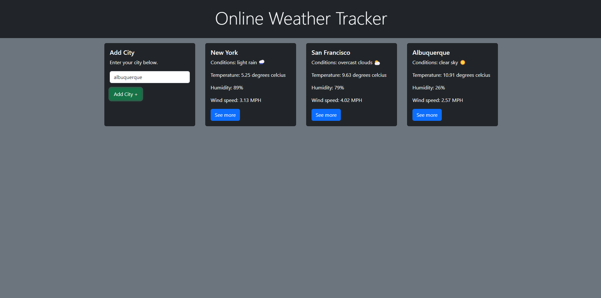

# Weather Tracker

# Description

A site that allows users to add cities to a list that is stored client-side in the browser. From here, they are given a simple UI that shows them the current weather status in those cities.

# Table of Contents

- [Description](#Description)

- [Installation](#Installation)

- [Usage Information](#Usage-Information)

- [Contribution guidelines](#Contribution-guidelines)

- [Test instructions](#Test-instructions)

- [License](#License)

# Installation

This project does not require any installation to be used. It can be used at it's live deployment site.

# Usage Information

To use, enter the name of a city. This is not case sensitive. Then, click add city. If you would like to remove a city from your list, simply click the X and it will be dropped.

# Contribution guidelines

This project is open to contributions. Please don't hesitate to reach out!

# Test instructions

N/A

# License
    
- [MIT] https://www.mit.edu/~amini/LICENSE.md

# Questions?

- GitHub: jarenella

- Email: jamesa122333@gmail.com

